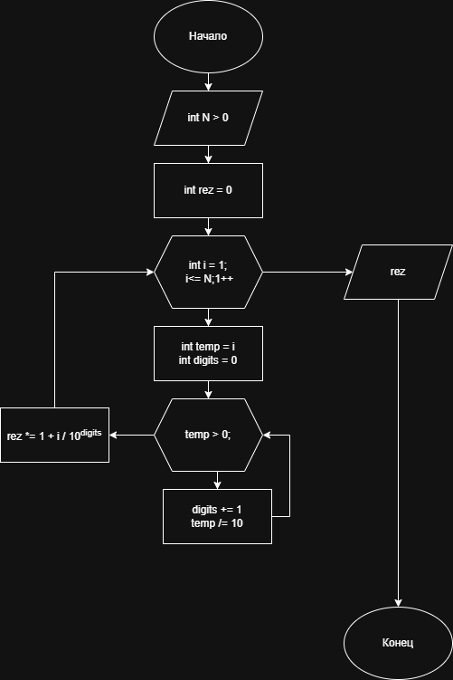

# Домашнее задание к работе 8

## Условие задачи
Вычислите для целого N, заданного пользователем, значение
произведения 1,1·1,2·1,3 · ...1,N
---
## 1. Алгоритм и блок схема

### Алгоритм
1. **Начало**
2. Объявить переменные:
   - `n` - входное число N
   - `rez` - результирующее произведение (инициализировать 1)
   - `temp` - временная переменная для подсчета цифр
   - `digits` - количество цифр в текущем числе
3. Запросить у пользователя N
4. В цикле `i =` от 1 до N
    	Считаем количество цифр в i(digits), делим i на 10^digits.
   		`rez *= 1.0 + i / 10^digits`
5. Вывести результат
6. **Конец**

### Блок-схема


 [Ссылка на блок-схему](https://viewer.diagrams.net/?tags=%7B%7D&lightbox=1&highlight=0000ff&edit=_blank&layers=1&nav=1&title=Lab8_schema.drawio&dark=auto#Uhttps%3A%2F%2Fdrive.google.com%2Fuc%3Fid%3D1cBskoY_KU7yTj2_1Y4-Y3R1Gd1yOZScB%26export%3Ddownload)

 ## 2. Реализация программы

```c
#include <stdio.h>
#include <math.h>
int main() {
	
	unsigned int n;
	double rez = 1;

	unsigned int temp = 0;
	unsigned int digits = 0;

	puts("Enter N:");
	scanf("%u", &n);

	for (unsigned int i = 1; i <= n; i++)
	{
		unsigned int temp = i;
		unsigned int digits = 0;
		while (temp > 0) {
			temp /= 10;
			digits++;
		}

		rez *= 1.0 + i / pow(10,digits);
	}

	printf("Result = %f", rez);

	return 0;
}
```
# 3. Результаты работы программы
Enter N:
11
Result = 40.930519
# 4. Информация о разработчике
Авраменко Дмитрий бИПТ-251
